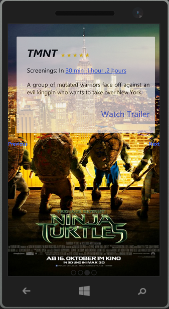

#CatchAMovie :movie_camera:
> A Windows 8 app written in JavaScript

  

## 📦 Dependencies

* [jQuery](https://jquery.com/)
* [jQuery TS](https://www.nuget.org/packages/jquery.TypeScript.DefinitelyTyped/)
* [Handlebars](https://www.nuget.org/packages/Handlebars.js/)
* [SuperSlides](http://archive.nicinabox.com/superslides/#1)
* [Semantic](https://www.nuget.org/packages/Semantic/)

## License
[WTFPL](./license) © [Raghib Hasan](http://raghibm.com/)
